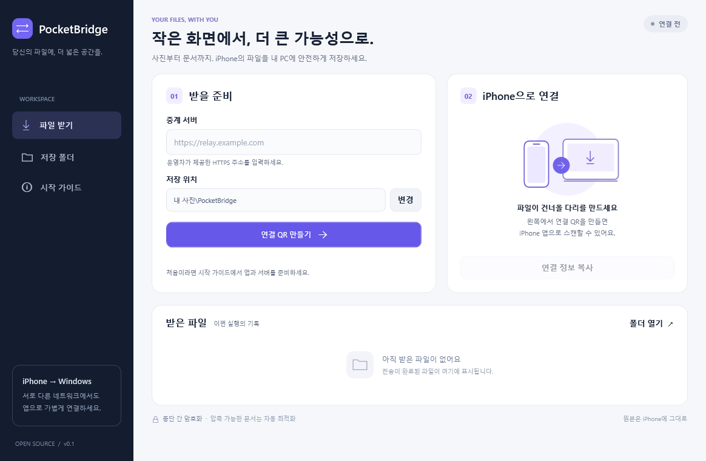
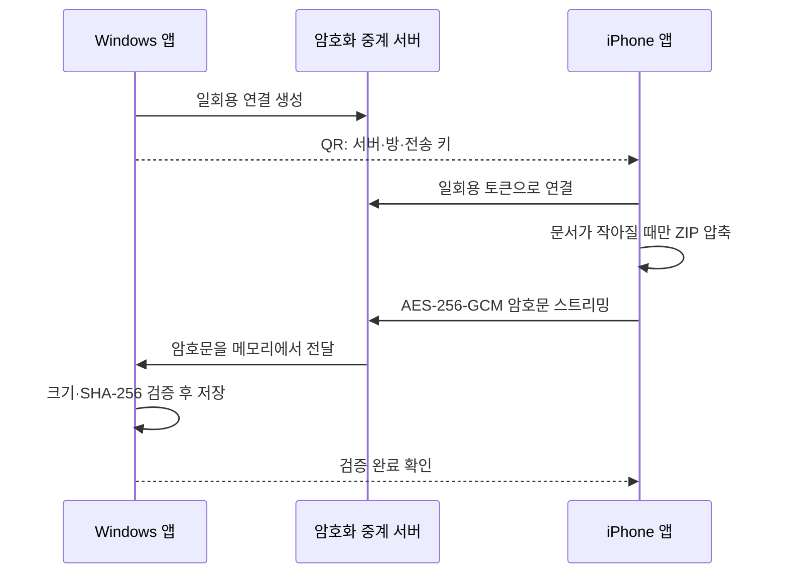

# PocketBridge

PocketBridge는 iPhone에서 Windows PC로 사진, 동영상, 문서를 보내는 네이티브 전송 앱입니다. 두 기기가 같은 Wi-Fi에 있을 필요가 없습니다. Windows 앱이 보여 주는 QR을 iPhone 앱으로 스캔하고 파일을 고른 뒤 전송합니다.



> 현재 상태: GitHub에서 직접 빌드하고 배포할 수 있는 첫 공개 개발 버전입니다. Windows 수신 앱과 중계 서버는 이 저장소에서 빌드·통합 테스트했습니다. iOS 앱은 소스와 XcodeGen 프로젝트를 제공하지만 Windows 개발 환경의 한계로 실제 iPhone 빌드와 실기기 전송은 아직 검증하지 못했습니다.

## 동작 방식



- 사용자 화면은 Windows WPF와 iOS SwiftUI로 만든 네이티브 앱입니다. 중계 서버는 화면을 제공하지 않습니다.
- 파일명과 파일 데이터는 Windows 앱이 만든 256비트 키로 종단간 암호화됩니다. 키는 QR에만 들어가며 중계 서버로 보내지 않습니다.
- 큰 파일을 256 KiB 단위로 읽어 전송하므로 파일 전체를 메모리에 올리지 않습니다.
- 텍스트 계열 문서는 ZIP으로 압축했을 때 5% 이상 작아지는 경우에만 압축본을 전송합니다. 이미 압축된 사진, 동영상, PDF, Office 문서는 원본 그대로 보냅니다.
- Windows는 수신 파일의 원본 크기와 SHA-256을 검증한 뒤 저장합니다. 기존 파일을 덮어쓰거나 iPhone 원본을 삭제하지 않습니다.

## 저장소 구성

- `src/PocketBridge.Windows`: Windows 10/11 수신 앱 (.NET 10 WPF)
- `ios/PocketBridge`: iPhone 송신 앱 (SwiftUI, iOS 17 이상)
- `src/PocketBridge.Relay`: 서로 다른 네트워크를 이어 주는 ASP.NET Core WebSocket 중계 서버
- `src/PocketBridge.Core`: 암호화, 검증, 안전한 파일 저장 로직
- `tests`: 실제 WebSocket 중계와 파일 무결성 검사

## 바로 시작하기

### 1. 중계 서버 준비

서로 다른 네트워크에서 사용하려면 공개 HTTPS 주소가 필요합니다. 저장소에는 운영 중인 공용 서버가 포함되지 않습니다. 서버 한 대에 Docker 컨테이너를 실행하고 Nginx나 호스팅 서비스에서 HTTPS와 WebSocket을 연결하세요.

```bash
docker build -f src/PocketBridge.Relay/Dockerfile -t pocketbridge-relay .
docker run -d --restart unless-stopped -p 127.0.0.1:8080:8080 pocketbridge-relay
```

자세한 보안 설정과 Nginx 예시는 [중계 서버 배포 안내](docs/relay.md)를 참고하세요.

### 2. Windows 앱 실행

.NET 10 SDK가 설치된 Windows에서:

```powershell
dotnet run --project src/PocketBridge.Windows -c Release
```

앱에 `https://relay.example.com` 형태의 중계 서버 주소와 저장 폴더를 입력하고 **연결 만들기**를 누릅니다. 배포용 단일 폴더는 다음 명령으로 만듭니다.

```powershell
./scripts/publish-windows.ps1
```

공개 Release에 올리는 Windows 실행 파일은 코드 서명을 추가하기 전까지 Windows SmartScreen 경고가 표시될 수 있습니다. 사용자가 신뢰할 수 있는 배포를 하려면 릴리스 파이프라인에 본인의 Windows 코드 서명 인증서를 연결하세요.

### 3. iPhone 앱 빌드

macOS, Xcode, [XcodeGen](https://github.com/yonaskolb/XcodeGen)이 필요합니다.

```bash
cd ios
xcodegen generate
open PocketBridge.xcodeproj
```

Apple Developer Team과 앱 식별자를 자신의 값으로 설정하고 iPhone에 설치합니다. 자세한 절차는 [iPhone 앱 빌드 안내](docs/ios.md)를 참고하세요.

## 개발과 검증

필요 도구는 .NET 10 SDK입니다.

```powershell
dotnet build PocketBridge.slnx -c Release
dotnet run --project tests/PocketBridge.Tests -c Release
dotnet run --project tests/RelaySmoke -c Release
```

`PocketBridge.Tests`는 암호문 변조, 잘못된 키, 경로 조작, ZIP 확장 제한, 중복 파일명, 중단된 전송 정리를 검사합니다. `RelaySmoke`는 로컬 중계 서버를 직접 시작해 토큰 인증, 양방향 전송, 메시지 크기 제한과 연결 정리를 검사합니다.

## 지원 범위

iOS의 파일 선택기나 사진 선택기에서 사용자가 명시적으로 고른 파일을 전송합니다. iOS 보안 정책상 다른 앱의 비공개 저장소나 iPhone 전체 파일 시스템을 탐색할 수 없습니다. iCloud에만 있고 기기에 내려받지 않은 항목은 선택 과정에서 iOS가 먼저 내려받아야 하므로 시간이 더 걸리거나 네트워크 상태에 따라 실패할 수 있습니다.

현재 버전은 한 번에 한 iPhone과 연결하며 파일을 순서대로 전송합니다. 연결이 끊기면 미완료 파일을 버리고 새 QR로 다시 연결합니다. 폴더 구조, Photos 앨범 구조, Live Photo의 편집 정보, 중단 지점 이어받기는 아직 지원하지 않습니다.

## 보안 제보와 라이선스

민감한 취약점은 공개 Issue 대신 저장소의 GitHub Security Advisory로 제보해 주세요. 일반 버그는 환경, 재현 순서, 로그에서 토큰과 QR 내용을 제거한 뒤 Issue로 등록하면 됩니다.

MIT License로 배포합니다. 자세한 내용은 [LICENSE](LICENSE)를 확인하세요.
